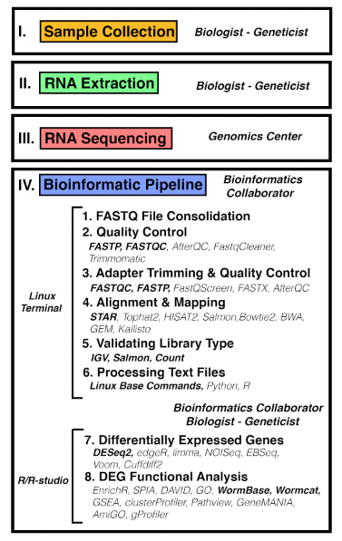

# Celegans_RNASeq2023
**PadillaLabUNT**: [Springer Protocols MiMB protocols]

**Book Title:** Transcriptome Data Analysis - Book © 2024

**Editors:** Rajeev K. Azad

**Methods in Molecular Biology** (MIMB, volume 2812) - Springer Protocols

**Copyright Information** The Editor(s) (if applicable) and The Author(s), under exclusive license to Springer Science+Business Media, LLC, part of Springer Nature 2024

**DOI** https://doi.org/10.1007/978-1-0716-3886-6
**eBook ISBN** 978-1-0716-3886-6 
**Published:** 27 July 2024
**Hardcover ISBN** 978-1-0716-3885-9
Published: 28 July 2024

# RNA-sequencing experimental analysis workflow using Caenorhabditis elegans Pages 115-141

**Authors:** Jose Robledo, Saifun Ripa Nahar, Manuel A. Ruiz, Raymond J. Hendricks, David J. Burks, Mary L. Ladage, Taegun Kwon, Rajeev K. Azad, Pamela A. Padilla 1

1Department of Biological Sciences, University of North Texas, Denton, TX 76203

**Running Title:** RNA-SEQUENCING WORKFLOW IN CAENORHABDITIS ELEGANS

**Key Words:** RNA-sequencing, bioinformatic pipeline, differentially expressed genes, reproducibility

**Corresponding Author:**

Pamela A. Padilla (PI)
University of North Texas
Department of Biological Sciences
1155 Union Circle #305220
Denton, TX 76203
(940)565-3614
pamela.padilla@unt.edu

Jose Robledo (Graduate Student)
University of North Texas
Department of Biological Sciences
1155 Union Circle #305220
Denton, TX 76203
JoseRobledo@my.unt.edu

# Cite this protocol

Robledo, J. et al. (2024). RNA Sequencing Experimental Analysis Workflow Using Caenorhabditis elegans. In: Azad, R.K. (eds) Transcriptome Data Analysis. Methods in Molecular Biology, vol 2812. Humana, New York, NY. https://doi.org/10.1007/978-1-0716-3886-6_6

# File Descriptions

- RNA_Seq_Methods.html - html download file and can be opened on your browser
- MiMB_fig.png - Figure 1 from MiMB chapter protocol

